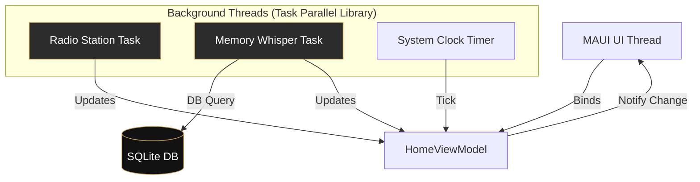

# 🏛️ Architecture Guide: Not-So-Forgotten Cemetery

This document provides a technical deep dive into the engineering principles and design patterns used in the cemetery.

---

## 🧩 Architectural Pattern: MVVM
The project is built on the **MVVM (Model-View-ViewModel)** pattern, leveraging **Dependency Injection** for clean service management and **Async/Await** for responsive multi-threading.

### 🧵 Multi-Threading Architecture

The following diagram illustrates how the application manages background tasks to maintain a responsive UI while simulating the atmospheric radio and memory whispers.

## 🏗️ Service Layer & Inversion of Control
Every major technical component (Database, Spotify, YouTube) is abstracted behind an **Interface**. This allows for:
- **Testability**: Services can be easily mocked using tools like `Moq`.
- **Flexibility**: The underlying implementation can change (e.g., switching from SQLite to a cloud DB) without affecting the UI.

### Dependency Injection (DI)
Services and ViewModels are registered in the MAUI container in `MauiProgram.cs`. All service contracts are located in the `Services/` directory for modularity.

## 🧪 Quality Assurance: Unit Testing
The project includes a comprehensive **xUnit** test suite with **54 automated tests** covering:
- **ViewModels**: Validation of business logic and property change notifications.
- **Service Mocking**: Using `Moq` to simulate database and external API behavior.
- **Architecture Shims**: A `MauiStubs` system allows testing ViewModels without a live MAUI environment.

## 💾 Database Schema
The app uses **SQLite** for lightweight, async local storage.
- `MemoryDb`: Stores graves (title, description, date).
- `WhisperDb`: Stores ghostly messages revealed by background threads.
- `UserProfileDb`: Stores cemetery visitor preferences.
- `PlaylistDb`: Stores curated collections of songs.

## 🧵 Concurrency & Threading
The project demonstrates advanced threading handling:
- **Background Tasks**: The "Radio Station" and "Memory Whispers" run on separate threads to keep the UI responsive.
- **Cancellation**: All long-running tasks use `CancellationTokenSource` to ensure proper cleanup when a page is closed.

---

_“The structure is the skeleton that keeps the memories upright.”_
